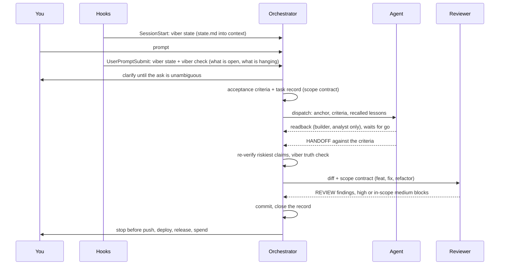
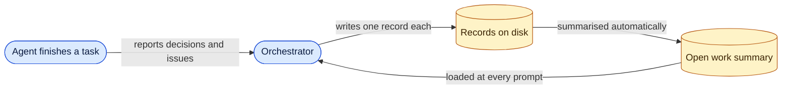
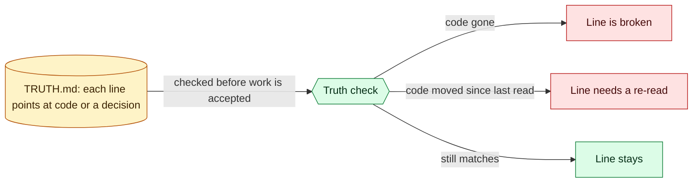

# viber

A harness for Claude Code. You talk; one orchestrator runs the loop. It clarifies the ask, writes the acceptance criteria, hands each piece to the agent whose model fits it, audits the handoff, sends every code change through a reviewer, commits, and stops for you before anything hard to undo. It also runs the CLI that keeps memory current; you never type a viber command.

Stdlib Python 3.8+ for the CLI, nothing else.

## Why this exists

This is my personal harness. I use it to build the apps on [dangnguyen.app](https://dangnguyen.app), and to run Claude as my day-to-day assistant.

Context, memory, reviews, model routing: plenty of repos already handle each of these. They do it one piece at a time, though, and stacking them never fit how I work. For someone new it is overwhelming. You have probably read a "30 plugins you need for Claude Code" post by now.

You do not need to install anything, at least not at first. Use Claude Code as it is until you hit a real problem in the way you work, then find the fix for that problem. Do not collect fixes for problems you do not have yet.

So everything here is something I wrote to fix a problem I actually hit, and it keeps changing as I keep building.

## One session



## What's in it

Everything lives in `template/` and copies into your project as is.

| Part | Path | What it is |
|---|---|---|
| Rules | `CLAUDE.md` | The orchestrator's contract: roles, the work loop, routing table, memory rules, review gate, git rules. `AGENTS.md` points at it so other tools read the same file. |
| Agents | `.claude/agents/*.md` | Six definitions, each pinned to a model: `analyst` (opus), `builder` (opus), `coder` (sonnet), `grunt` (haiku), `reviewer` (sonnet), `runner` (haiku, executes a written test or capture plan and returns artifacts, never a verdict). |
| Hooks | `.claude/settings.json` | `SessionStart` regenerates memory into context; `UserPromptSubmit` does that again and lists what is hanging, so every prompt starts current. |
| CLI | `.viber/bin/viber` | One Python file the orchestrator runs: records, facts, lessons, findings, signals, truth check, code graph, health report. |
| Memory | `.viber/memory/records/` | One file per record: `decision`, `task`, `issue`, `lesson`, `milestone`, `question`, `fact`. `state.md` and `index.md` are generated from them. |
| Truth | `.viber/docs/TRUTH.md` | What is true about the project now. Every line carries an anchor to a source symbol or a record; a line without one fails the check. |

## Problem, and what viber does about it

| Pain | Mechanism |
|---|---|
| The agent says "done" and it is not | Acceptance criteria are written before dispatch, by the orchestrator, not the agent. The agent reports against them in a `HANDOFF:` block; the orchestrator re-runs the riskiest claims itself before accepting. |
| Hard work goes to a cheap model, trivial work to an expensive one | Four routing questions pick the agent; the agent definition pins the model. Ties size up (`builder` over `coder`) and away from guessing (`coder` over `grunt`). A definition with no model line is reported as a framework fault every prompt. |
| Context is lost between sessions | Decisions, tasks, lessons and issues are records on disk. The session-start hook regenerates them into the first prompt. |
| Numbers in memory go stale | A fact is stored as a location (`file` + `symbol`), never as a value; state resolves it from source on every regen. |
| Docs drift from code | Every claim in `TRUTH.md` anchors to a symbol or a record. The check reports a symbol that is gone, a line with no anchor, and a claim whose code moved since anyone last read it. A diff surfaces the claims it touches. |
| The same mistake repeats | Owner rejections, spec gaps, dead ends, surprises and escaped bugs are raised as signals; reopened work and returning defects are raised by the CLI itself. Each is an open record nagged every turn until closed. A signal worth keeping becomes a lesson scoped to an agent and a topic, and the orchestrator recalls those lessons into every dispatch. A lesson naming a file that no longer exists is flagged stale at recall. |
| A scope claim is a grep guess | `viber graph deps` walks imports (`.ts .tsx .js .jsx .dart .py .gd`) and prints a coverage line saying how many files it parsed, so "no other callers" is a measured claim or an admitted blind spot. |
| Code commits nobody read | A `feat`, `fix` or `refactor` commit waits for a fresh `reviewer` to read the diff against a scope contract (anchor, base commit, file globs, criteria). Any high or in-scope medium finding blocks. Two rounds at most, then the orchestrator decides. |
| Findings get fixed on the surface and come back | Each recorded finding is fingerprinted by file and problem; a second sighting raises a repeat signal instead of a fresh record. |
| Parallel agents clobber each other | Concurrent agents get disjoint file scopes and their own scratch prefix, prove only their own change, and the project suite runs once over the union after all have landed. |
| A subagent burns budget waiting | Rules and agent definitions forbid `sleep` polling: long jobs run in the background, raw output goes to a file. |
| Secrets slip into a commit | Every prompt reports lines in the working tree that look like a live credential; the orchestrator stops there and never deletes or unstages on its own. |
| The harness itself rots | A dead hook, a missing agent file, invalid `settings.json`, duplicate record ids, or a `state.md` older than its records is reported at the top of every prompt. |

## Where the data goes

Three loops run in the background. Blue is who acts, yellow is what is stored on disk, green is a check.

**Memory: nothing is forgotten between sessions**



**Learning: a mistake is not made twice**

```mermaid
flowchart LR
    M([Something goes wrong]) -->|rejected work, spec gap, dead end, bug that came back| G{{Open signal}}
    G -->|nagged every prompt until handled| O([Orchestrator])
    O -->|turns it into a lesson for one agent and topic| L[(Lessons)]
    L -->|pasted into the next brief for that agent| A([Agent])
    classDef actor fill:#dbeafe,stroke:#1d4ed8,color:#0b1b3f
    classDef store fill:#fef3c7,stroke:#b45309,color:#3b2303
    classDef check fill:#dcfce7,stroke:#15803d,color:#052e16
    class M,O,A actor
    class L store
    class G check
```



**Truth: the docs cannot quietly drift from the code**



## Install

```bash
git clone https://github.com/dangnhh92/viber-harness viber
git -C viber archive HEAD template | tar -x --strip-components=1 -C my-project/
cd my-project
python3 .viber/bin/viber init
```

`git archive` copies only the files viber tracks, so no `.DS_Store` comes along. `init` creates `.viber/memory/records/`, `.viber/docs/`, `src/` and generates `state.md`. This is the one command you run yourself.

Copying into an existing project overwrites `CLAUDE.md`, `AGENTS.md` and `.gitignore`. Extract into an empty folder first and merge by hand if you already have those.

There is no update command. To pick up a newer viber, `git -C viber pull`, run the same `git archive` line again and diff `CLAUDE.md` before overwriting your edits.

## Recommended workflow

Open the project in Claude Code and talk. This is what to expect.

1. **Say what you want in plain words.** It asks until the ask is unambiguous: what good looks like, what is out of scope, any hard constraint. Answer those; they become the criteria it checks against.
2. **It writes the acceptance criteria and opens a task record.** For a code change the record is the scope contract: anchor, base commit, file globs, criteria.
3. **It routes and dispatches.** Analysis and documents to `analyst`, large or risky code to `builder`, small decided code to `coder`, bulk mechanical edits to `grunt`. Lessons for that agent and topic go in with the brief. `builder` and `analyst` first read the task back in four lines and wait for a go.
4. **It audits the handoff.** Riskiest "met" claims get re-run; the truth check runs; an incomplete handoff goes back to the same agent.
5. **It reviews before committing.** A fresh `reviewer` reads the diff against the contract. Blocking findings go back verbatim to the implementer and are recorded so a recurrence is counted.
6. **It commits and closes the record.** Then it stops for you before anything hard to undo: a push where others can read, a deploy, a release, spending money.

Small work skips the ceremony: a one-line fix is one loop, done by the orchestrator itself, no subagent and no readback, and the review gate still runs if the commit is `feat`, `fix` or `refactor`.

What helps: answer the clarifying questions, let it pick the agent and take its pushback seriously (it is told to disagree out loud).

## Plugins, when you need them

Start with none. When a problem keeps coming back, add the one plugin that fixes it. These are the official-marketplace plugins I ended up adding, each next to the problem that made me add it.

| Problem you hit | Plugin |
|---|---|
| The agent writes code against an old version of a library | `context7` (current library docs) |
| The agent says the UI works but never looked at it | `playwright` (it opens the page and sees it) |
| Symbol lookups by grep miss things | the LSP plugin for your stack (`typescript-lsp`, `swift-lsp`) |
| You want to talk to the orchestrator away from the desk | `telegram` (set `ackReaction` so you see the message landed) |
| Deploys, databases, designs live in a service | that service's plugin: `vercel`, `firebase`, `supabase`, `github`, `figma`, `railway` |
| UI and copy come out generic | `frontend-design`, and the skill `impeccable` for a UI, UX and copy audit |

Some plugins overlap with what viber already does: `superpowers` (its process skills compete with the clarify step; viber's `CLAUDE.md` wins as user instructions), `code-review` and `commit-commands` (viber has its own review gate and commit rules). Know that before enabling them.

<details>
<summary>CLI reference (the orchestrator runs these)</summary>

```
viber new <type> "<title>" [--tags a,b] [--body "..."]
viber set <id> <status>                 open | doing | blocked | done | dropped
viber list [--status s] [--type t] [--tag x]
viber show <id>
viber fact "<label>" <file> <symbol>
viber finding <file> "<problem>" [--severity high|medium|low]
viber trigger <kind> "<what happened>"
viber lessons --for <role> [--tags a,b] [--limit 5]
viber truth check | surface | gaps | confirm
viber graph build | deps <R-042|doc:NAME.md|path::SYMBOL> | orphans
viber check      (runs on every prompt)
viber doctor
viber state | index | init
```

</details>

